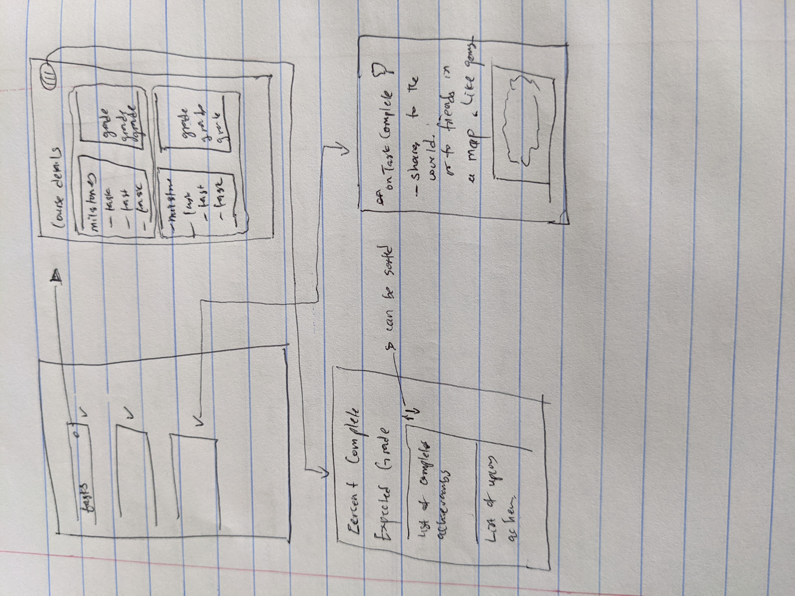

Original App Design Project - README Template
===

# College Helper

## Table of Contents
1. [Overview](#Overview)
1. [Product Spec](#Product-Spec)
1. [Wireframes](#Wireframes)
2. [Schema](#Schema)

## Overview
### Description
An app to help stay organized in college. Using class times, study times, and appointments from emails, the app produces a routine that a person can follow through the day. That way, the student can keep on top of classes.

### App Evaluation
[Evaluation of your app across the following attributes]
- **Category:** Utility
- **Mobile:** Yes
- **Story:** The app helps students to build a routine for each day.
- **Market:** College Students
- **Habit:** The app would be followed through the day alongside the notifications it will be giving.
- **Scope:** Can be used for college students and could be expanded to other professions.

## Product Spec

### 1. User Stories (Required and Optional)

**Required Must-have Stories**

* A daily schedule
* A checklist of daily todos
* Ranking of students based on how they complete tasks
* User can login
* User's achievement is shared using game achievement lingo.
* User can create roadmap of tasks for courses
* User will have a timeline of completed tasks 

**Optional Nice-to-have Stories**

* Guides on productivity
* Guides on mental health
* User will have achievements of focus times during study.

### 2. Screen Archetypes

* Start
   * The day screen containing events for the day. These events include assignments, classes and exams for each college class. On clicking the event, we navigate to the screen for that course.
   
* Achievements 
   * Showcase of how productive a student has been
* Course Monitor
    * Monitors the grade in a course and how much work needs to be done to complete the course successfully.
* Share to the world
    * Share your achievements to your friends on the network.

### 3. Navigation

**Tab Navigation** (Tab to Screen)

* Start
* Course Monitor
* Achievements

**Flow Navigation** (Screen to Screen)

* Start
   * On clicking a denoted sign on an event, we go to the Course Monitor Screen.
  
* Achievement to Share to the World
   * Shares an insight achievement or completed task to friends within the course network.
   

## Wireframes
[Add picture of your hand sketched wireframes in this section]

### [BONUS] Digital Wireframes & Mockups

### [BONUS] Interactive Prototype

## Schema 
[This section will be completed in Unit 9]
### Models
[Add table of models]
### Networking
- [Add list of network requests by screen ]
- [Create basic snippets for each Parse network request]
- [OPTIONAL: List endpoints if using existing API such as Yelp]
